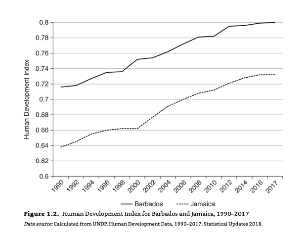

I've been reading Orlando Patterson's [The Confounding Island: Jamaica and the Postcolonial Predicament](https://www.amazon.com/Confounding-Island-Jamaica-Postcolonial-Predicament/dp/0674988051), and came accross this graph in chapter one. 



The graph compaires the Human Development Index scores for Barbados and Jamaica from 1990 to 2017. In chapter one Patterson compares Jamaica and Barbados, and explores why Barbados has had such different outcomes relative to Jamaica, despite both sharing an (arguably) similar colonial history. He writes: 

>Barbados in 1966) with per capita incomes of $8,666 for Barbados and $4,960 for Jamaica (both in constant 2011 US dollars), Barbados by 2000 had a real per capita GDP of $22,694 compared with Jamaica’s $5,819, almost four times greater. Since then, the per capita GDP of Barbados has declined in the face of harsh external shocks to its economy, especially that caused by the Great Recession of 2008, to which it was more susceptible because of its greater global exposure. Even so, its per capita GDP is still more than twice that of Jamaica. Per capita GDP, as is well known, is a limited gauge of a nation’s true standard of living. But on most other major social and economic indices Barbados also stands well ahead of Jamaica and indeed ahead of nearly all of the Caribbean and Latin America. Its score on the Human Development Index (a composite of life expectancy, educational attainment, and living standards) for 2017 places it in the group of very high human development, far above Jamaica, and much the same holds for other indices: labor force participation, unemployment, literacy, and so on (see Table 1.1 and Figure 1.2 ). Of special note is the stark difference in homicide rate. In recent decades Jamaica has seen some of the worst crime rates in the world—55 per 100,000 in 2017, over five times that of Barbados, at 10.9 per 100,000—the total cost of which the World Bank estimated at 3.7 percent of GDP in 2001, with a generally disastrous effect on business and social well-being (World Bank 2004: 115–139). 

(Orlando 2019: Kindle Locations 456-468)

He goes on to discuss whether these differences are the result of different government policies or the results of different institutions. 

For my part, I'd been away from R and ggplot2 for a while, and wanted to see if I could recreate the graph as a way of getting back into the swing of things. Here are the steps:

```{r setup, include=FALSE}
knitr::opts_chunk$set(echo = TRUE)
```
##Load the required libraries: 
```{r message=FALSE}
library(tidyverse)
library(reshape2)
library(naniar)
library(scales)
library(lubridate)
```

##Get data and clean:
Download the [data](http://hdr.undp.org/en/data#), and import it into R.  
```{r message=FALSE}
hdi<- read_csv("data/hdi.csv")
```

Replace missing values with NA. 
```{r}
hdi_clean <- hdi%>% replace_with_na_all(condition = ~.x == "..")
```

Reshape the data from wide to long. 
```{r}
hdi_clean <- melt(hdi_clean,id=c("rank","country"))
hdi_clean <- na.omit(hdi_clean)
```

##Make the plot:
```{r}
#Countries to include in the plot
interested <- c("Jamaica","Barbados")
p <- ggplot(data = subset(hdi_clean, country %in% interested),
            #Format the years as dates
            mapping = aes (x=as.POSIXct(strptime(variable,"%Y")),
                           #Format the HDI data as numbers
                           y=as.numeric(value),
                           color=country))
p+geom_line(aes(group=country))+
  #Format x scales
  scale_x_datetime(labels = date_format("%Y"),
                   breaks = date_breaks("2 years"))+
  #Format y scales
  scale_y_continuous(breaks = seq(0.6,0.8, by=0.02))+
  expand_limits(y=0.6)+
  #Adjust the labeling
  labs(x=NULL,
       y="Human Development Index",
       color=NULL)+
  #Change the theme
  theme_minimal()+
  theme(legend.position = "bottom")
```

Mission accomplished! While I could have spent more time getting the visuals to exactly the same, I'm happy to leave it here. 

##Odd problems:
Initially I used `as.Date` instead of `as.POSIXct` to convert the years into date objects. When I did this however, all the dates were plotted one year later. [This](https://stackoverflow.com/questions/42973629/ggplot-date-scales-shifts-one-month-forward) post recomended switching the date format, which I've then done, and which seems to fix the issue.

##Next time: 
Were I tackling this project again, I think I would convert the years to dates before plotting. For anyone interested, there's more information on how to do that easily [here](http://socviz.co/appendix.html). 
