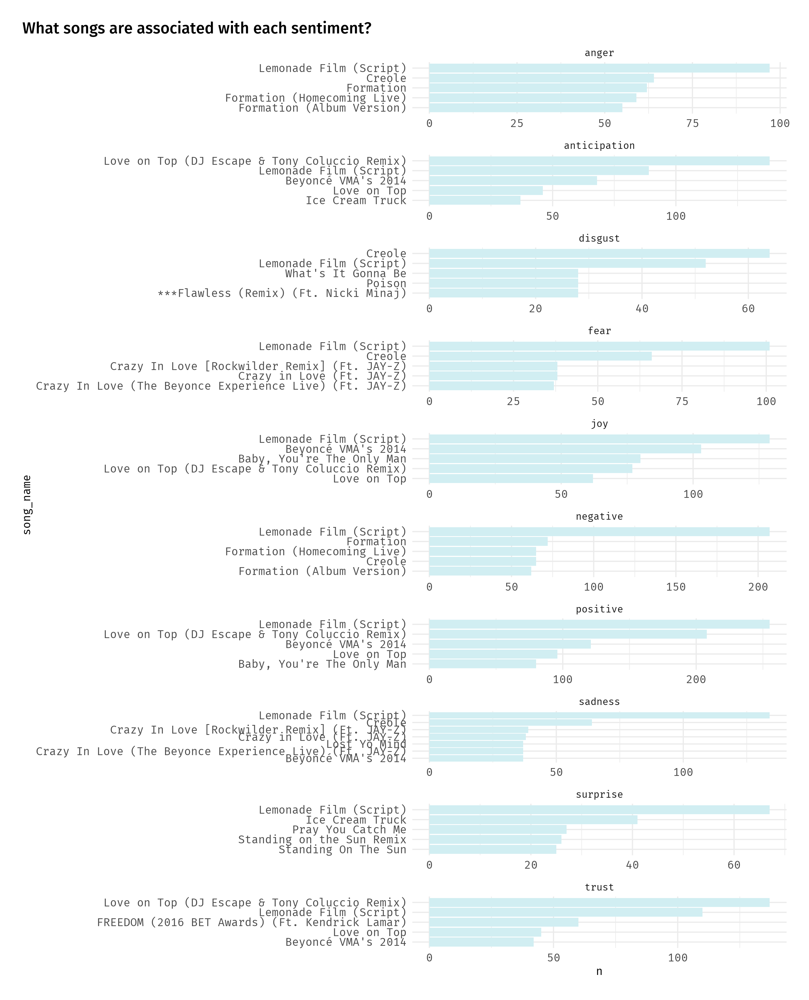
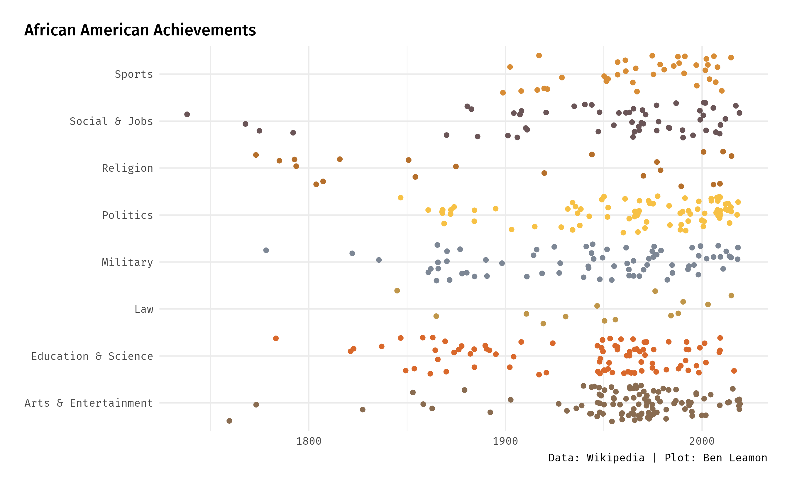

# Tidy Tuesday
Submissions and code for Tidy Tuesday challenges.

## 2021-04-20 Netflix

Code can be found [here](2021-04-20-netflix). Click for full-size images.

## 2020-09-29 Beyonce Lyrics

Code can be found [here](2020-09-29-beyonce-lyrics). Click for full-size images.

## Avatar the Last Airbender: 

## Animal Outcomes:

## African American Achievements:

## Cocktails

## Tour de France

## Beer Production

